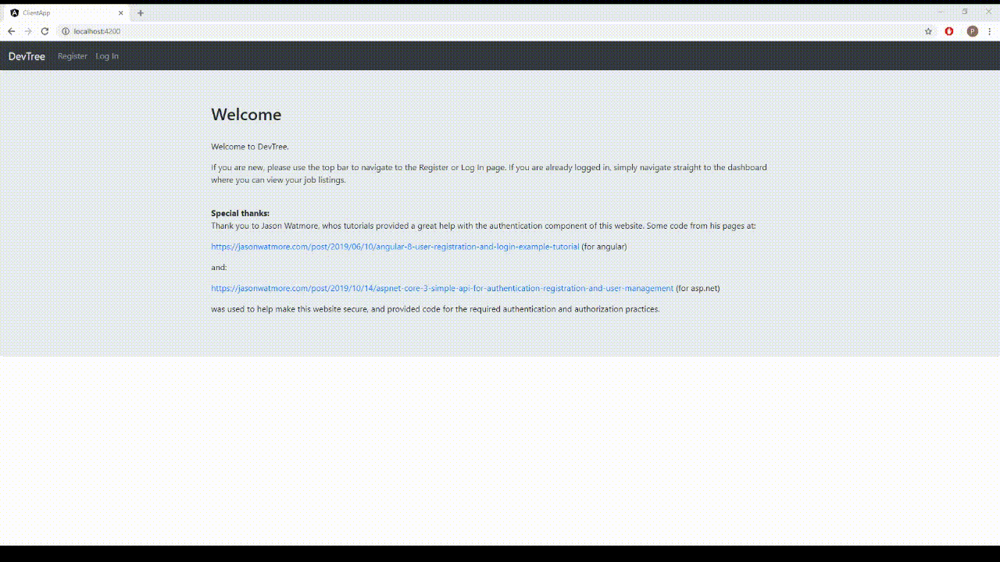

# DevTree
A website with the idea of being like gumtree, except for developers to buy and sell small tasks.



## Run the application
Use these instructions to get the project up and running.

### Dependencies
You will need:

* [Visual Studio Code or Visual Studio 2019](https://visualstudio.microsoft.com/vs/) (version 16.3 or later)
* [.NET Core SDK 3](https://dotnet.microsoft.com/download/dotnet-core/3.0)
* [Node.js](https://nodejs.org/en/) (version 10 or later) with npm (version 6.11.3 or later)

### Setup
Follow these steps to get your development environment set up:

  1. Clone the repository
  2. From the root directory, restore the required packages by running:
      ```
     dotnet restore
     ```
  3. Then build the solution by running:
     ```
     dotnet build
     ```
  4. Next, navigate to the `\WebApi` directory, and launch the backend by running:
      ```
     dotnet run
     ```
  5. After the backend has started, open another command window and navigate to the `\ClientApp` directory, and restore the required packages by running:
     ```
	 npm install
	 ```

  6. Finally, launch the frontend by running:
      ```
     npm start
     ```


  7. Launch [http://localhost:5000/](http://localhost:5000/api) in your browser to view the API
  
  8. Launch [http://localhost:4200/](http://localhost:4200/) in your browser to view the UI

## Technologies
* .NET Core 3
* ASP.NET Core 3
* Entity Framework Core 3
* Angular 9

## Credits
Credit for parts of the authentication and authorization setup go to Jason Watmore. Some of the code used in this application followed along his User Registration and Login Example & Tutorial from his pages: [https://jasonwatmore.com/post/2019/06/10/angular-8-user-registration-and-login-example-tutorial](https://jasonwatmore.com/post/2019/06/10/angular-8-user-registration-and-login-example-tutorial) and [https://jasonwatmore.com/post/2019/10/14/aspnet-core-3-simple-api-for-authentication-registration-and-user-management](https://jasonwatmore.com/post/2019/10/14/aspnet-core-3-simple-api-for-authentication-registration-and-user-management).

Also credit to Jason Taylor, from his project at [https://github.com/jasontaylordev/NorthwindTraders](https://github.com/jasontaylordev/NorthwindTraders). This readme was also based off the instructions he used for his project.
